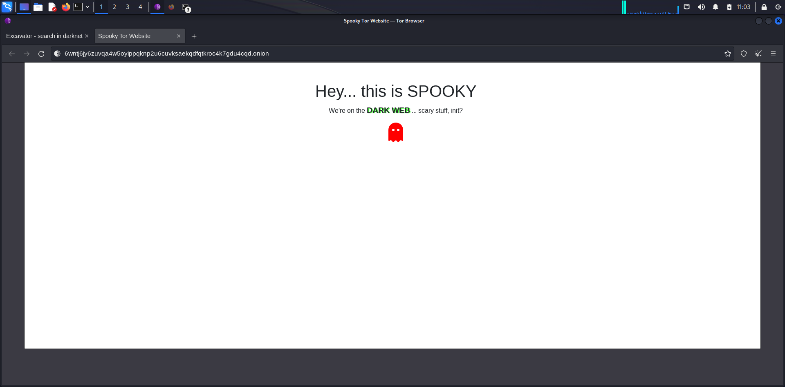

# DarkWebSite1

This is, quite simply, my (successful) attempt at making a site and hosting it on the dark web, temporarily, at the following address: 

`http://6wntj6jy6zuvqa4w5oyippqknp2u6cuvksaekqdfqtkroc4k7gdu4cqd.onion/`

This is what it looks like in the Tor browser accessed via Kali Linux VM on my laptop:

